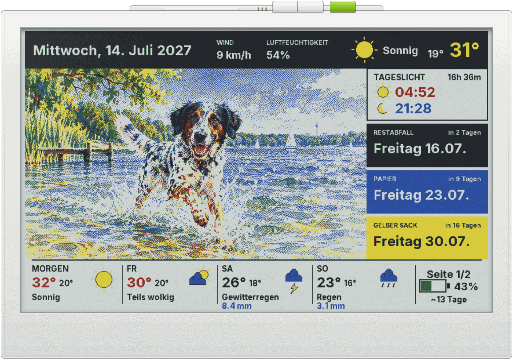
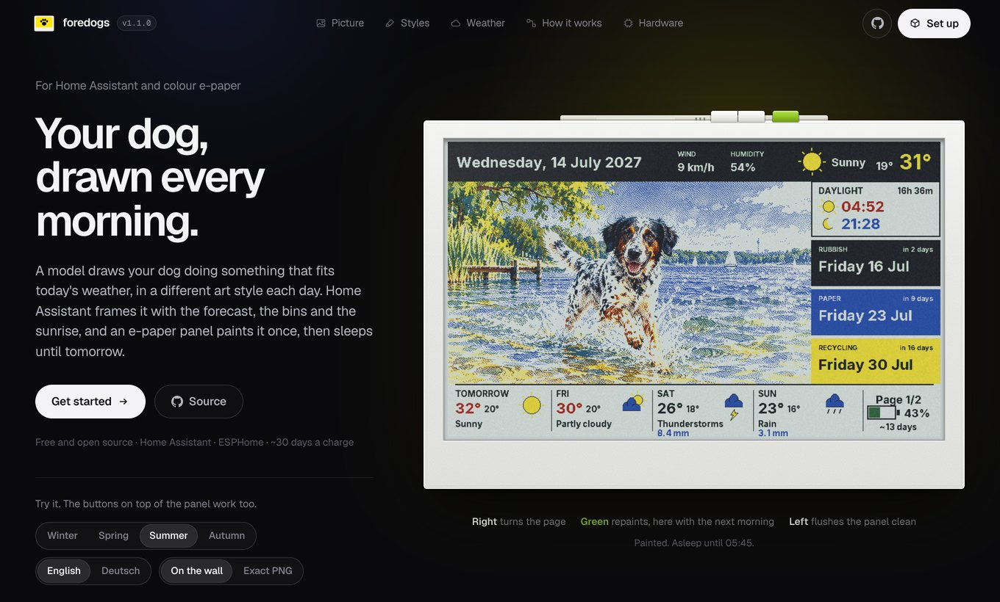
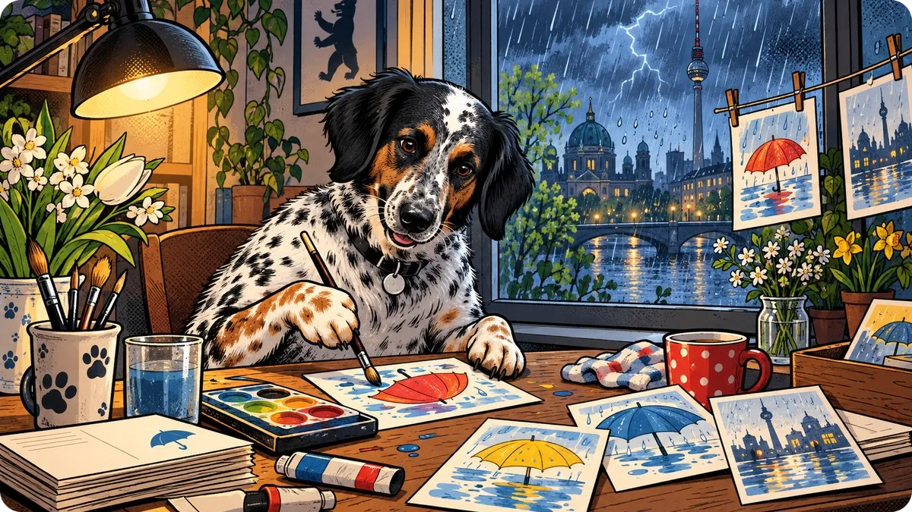
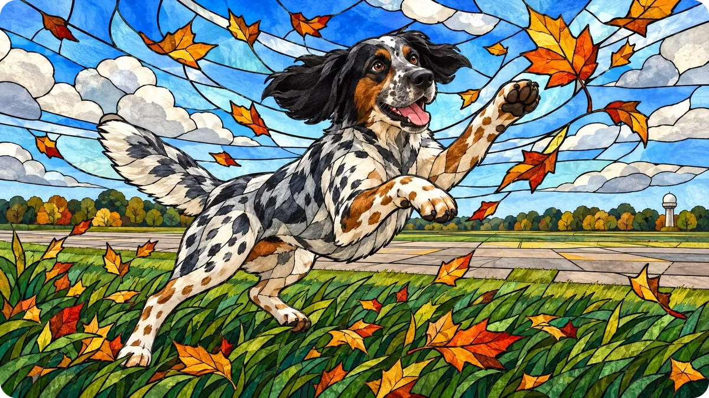
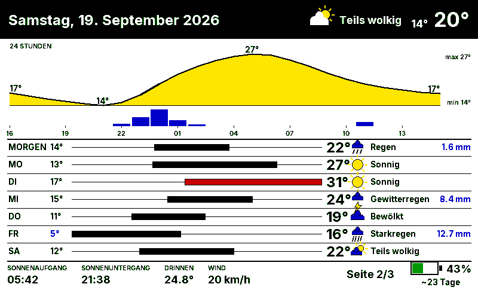
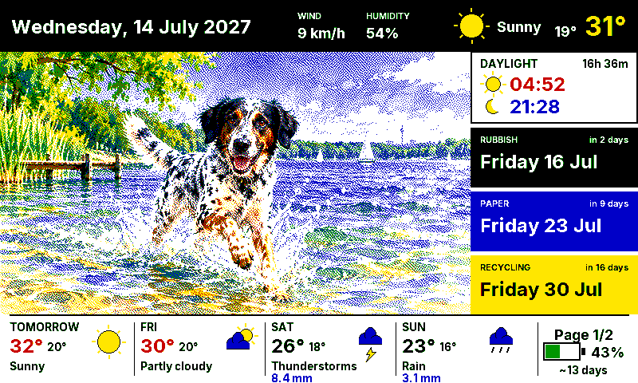
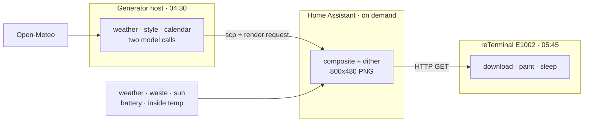

<div align="center">


# foredogs

**A picture of your dogs, drawn fresh every morning and painted onto a
battery-powered e-paper panel
<br>
With today's weather, the bins and the sunrise
around it.**

[](custom_components/foredogs)
[](esphome/e1002-kitchen.yaml)
[](generator)
[](docs/power.md)
[](LICENSE)

[Website](https://foredogs.nichtlegacy.com/) • [Overview](#overview) • [Live preview](#live-preview) • [Quick start](#quick-start) • [Configuration](#configuration) • [Architecture](#architecture) • [Hardware](#hardware) • [Docs](docs/README.md)

<a href="https://foredogs.nichtlegacy.com/"></a>

</div>

## Overview

Every morning a model draws your dogs doing something that fits today's weather,
in a different art style, wearing a costume if it happens to be someone's
birthday. Home Assistant composites that picture with live data into a single
800x480 PNG. A reTerminal E1002 wakes once a day, downloads it, paints it, and
sleeps for the next 23.9 hours.

## Live preview

<h3 align="center"><a href="https://foredogs.nichtlegacy.com/">foredogs.nichtlegacy.com</a></h3>

<p align="center">The panel in a browser: a reTerminal E1002 at its real proportions, with buttons that work.<br>
Turn the page, jump to the next morning, switch the season or the language.</p>

<p align="center">
  <a href="https://foredogs.nichtlegacy.com/"></a>
</p>

## Features

- **The weather is in the picture, not next to it.** A rainy forecast puts rain
  in the scene, a cold one puts a coat on the dog, and the sky matches the sky
  outside.
- **A rotating style pool.** Styles are picked from the least recently used
  quarter, so nothing repeats for roughly three quarters of the pool.
- **A calendar that matters.** German public holidays, Easter-relative dates,
  "the third Saturday in September", birthdays and anniversaries — each can
  contribute an outfit and a scene.
- **Six-colour aware rendering.** Atkinson dithering for the photo, hard
  quantization for text and chrome, so labels stay crisp where a photo would
  speckle.
- **German or English**, chosen per render call. Adding a language is one file.
- **A daily wake.** One refresh costs ~0.6 mAh, 24 h of deep sleep ~80 mAh, so
  the panel is measured at 0.12–0.17 %/h.
- **One button turns the page.** Press the right button and the panel wakes,
  switches between the picture and the weather detail, and goes back to sleep.
- **Bring your own model.** The Codex CLI, or any OpenAI-compatible endpoint.

## Gallery

Four mornings, one for each season, all generated for Berlin. Each is the raw
frame the model produced, before the dashboard crops and dithers it to six
colours.

<table>
<tr>
<td width="50%"><br><em><b>Spring</b> · rain, 6…14 °C<br>comic book, bold ink lines and flat colour</em></td>
<td width="50%"><br><em><b>Summer</b> · sunny, 19…31 °C<br>watercolour with soft bleeding edges</em></td>
</tr>
<tr>
<td width="50%"><br><em><b>Autumn</b> · windy, 6…12 °C<br>stained glass with lead came outlines</em></td>
<td width="50%"><br><em><b>Winter</b> · snow, −5…−1 °C<br>mid-century children's book illustration</em></td>
</tr>
</table>

<table>
<tr>
<td width="50%">

<br><em>Page 2 — the right button turns to it, and back.</em>
</td>
<td width="50%">

<br><em>The same panel, <code>language: en</code>.</em>
</td>
</tr>
</table>

### Reading page 2

Two things on it are not self-explanatory:

- **The blue bars along the hour axis are rainfall**, one per hour, in
  millimetres. Bar height runs to 4 mm/h and is clipped there — the chart
  supports one decision, coat or no coat, and past "heavy" the exact figure
  stops changing the answer. Hours under 0.05 mm draw nothing.
- **The bar between the two temperatures in each day row is that day's
  low-to-high range**, on a scale shared by every row. Further right means a
  warmer day, wider means a bigger swing between night and afternoon, and the
  thin line behind it is the full scale, so a calm day still reads as a
  position rather than a stray dash. The bar turns red above 28 °C and blue at
  or below 5 °C.

## Quick start

Three parts, each usable on its own.
[docs/setup.md](docs/setup.md) walks the same path with a verification step
after every stage — use that one if you are actually building it.

### 1. The generator

```sh
git clone https://github.com/nichtlegacy/foredogs.git ~/opt/foredogs
cd ~/opt/foredogs/generator
python3 -m pip install -r requirements.txt

cp ../examples/generator/config.example.json config.json
mkdir -p config assets/input_images
cp ../examples/generator/dogs.example.json config/dogs.json
cp ../examples/generator/art_styles.example.json config/art_styles.json
```

Put four or five photos of your dog in `assets/input_images/`, point
`config/dogs.json` at them, set `location` in `config.json`, then check the
prompts without spending anything:

```sh
python3 -m foredogs_generator.main --dry-run
cat output/latest_image_prompt.txt
```

Expected: a style is picked, the forecast is fetched, and two prompts are
written to `output/`. No image is generated and nothing is uploaded.

By default the generator drives the `codex` CLI. To use an API instead, set
`provider.kind` to `openai` and point `base_url` at OpenAI, Google, LiteLLM,
OpenRouter, Ollama or a local proxy — see
[docs/ai-providers.md](docs/ai-providers.md).

### 2. Home Assistant

Copy the component in, or add this repository to HACS as a custom repository:

```sh
scp -r custom_components/foredogs homeassistant:/config/custom_components/
```

Add `foredogs:` to `configuration.yaml`, copy the render script and the helpers
from [`examples/homeassistant/`](examples/homeassistant), restart, then call it
once by hand:

```yaml
action: foredogs.render_dashboard
data:
  weather_entity: weather.forecast_home
  image_dir: dogs
  language: de        # or en
```

Expected: `/config/www/daily_foredogs/dashboard.png` appears, 800x480, and the
service returns `changed: true`. Every field is documented in
[docs/dashboard.md](docs/dashboard.md).

### 3. The panel

```sh
cp esphome/secrets.yaml.example esphome/secrets.yaml   # then fill it in
esphome run esphome/e1002-kitchen.yaml
```

Expected: the device boots, asks Home Assistant to render, downloads the PNG,
paints it, and logs `Sleeping ... min until 05:45`. See
[docs/display.md](docs/display.md).

## Architecture

Three machines, each doing one thing, each able to fail without taking the panel
down.



The picture costs money and takes minutes. The composite costs nothing and takes
three seconds. The microcontroller does neither — it downloads a finished PNG.

That split is why the panel has never gone blank: a failed generation
leaves yesterday's picture with today's weather, a Home Assistant outage leaves
the last PNG, and a dead WiFi leaves the panel showing what it already painted.

The full flow, the daily timeline and the failure modes are in
[docs/architecture.md](docs/architecture.md).

## Configuration

| What | Where | Reference |
|---|---|---|
| Generator behaviour, weather, paths | `generator/config.json` | [configuration.md](docs/configuration.md) |
| Which model answers | the `provider` block | [ai-providers.md](docs/ai-providers.md) |
| Art styles and the calendar | `generator/config/` | [styles.md](docs/styles.md) |
| Which sensors feed the panel, and its language | the Home Assistant render script | [dashboard.md](docs/dashboard.md) |
| Schedules, helpers, the manual trigger | Home Assistant automations | [automation.md](docs/automation.md) |
| Wake time, hardware, OTA | `esphome/e1002-kitchen.yaml` | [display.md](docs/display.md) |

Secrets live in `~/.config/foredogs/` and in `secrets.yaml` files, never in this
repository. There is a one-line check to run before your first push in
[configuration.md](docs/configuration.md#secrets-and-credentials).

## Hardware

| | |
|---|---|
| **Panel** | Seeed Studio reTerminal E1002 — Spectra 6 colour e-paper, 800x480, ESP32-S3 |
| **Battery** | 2000 mAh, charged over USB-C |
| **Runtime** | 25–33 days per charge, measured at 0.12–0.17 %/h |
| **Sensors used** | On-board SHT40 for inside temperature and humidity, ADC on a 1:2 divider for the battery |

The panel is awake for about 40 seconds a day. One wake costs about 0.6 mAh;
24 hours of deep sleep costs about 80 mAh — so reaching deep sleep reliably
matters roughly a hundred times more than how often it refreshes. The
measurements, the calibration curve and the on-panel runtime estimate are in
[docs/power.md](docs/power.md).

## Project structure

- [`custom_components/foredogs/`](custom_components/foredogs) — the Home
  Assistant integration: the render service, the data collection, the Pillow
  renderer, the [languages](custom_components/foredogs/languages)
- [`generator/`](generator) — the standalone daily generator, its providers,
  scheduler units and tests
- [`esphome/`](esphome) — firmware for the reTerminal E1002
- [`examples/`](examples) — configuration to copy, for both sides
- [`tools/`](tools) — local dashboard preview, battery reporting
- [`site/`](site) — the landing page at
  [foredogs.nichtlegacy.com](https://foredogs.nichtlegacy.com/); its panel
  frames are drawn by the real renderer (`tools/build_screens.py`), and
  `tools/build_site.sh --serve` previews it
- [`tests/`](tests) — the integration's test suite
- [`docs/`](docs/README.md) — everything explained properly

## Documentation

| | |
|---|---|
| [architecture.md](docs/architecture.md) | The three machines, the daily flow, the timeline |
| [setup.md](docs/setup.md) | From nothing to a running panel, with checks |
| [generator.md](docs/generator.md) · [styles.md](docs/styles.md) · [ai-providers.md](docs/ai-providers.md) | The pipeline, the prompts, the style pool, the model backends |
| [home-assistant.md](docs/home-assistant.md) · [dashboard.md](docs/dashboard.md) · [automation.md](docs/automation.md) | The integration, every region of the panel, the schedules |
| [display.md](docs/display.md) · [power.md](docs/power.md) | Firmware, wake and sleep, battery life |
| [configuration.md](docs/configuration.md) · [operations.md](docs/operations.md) · [updating.md](docs/updating.md) | Every setting, every failure so far, and how to update |

## Privacy

The repository ships examples, not data. Your dogs' names and photographs, your
family's birthdays and your own style pool stay in untracked files:

| Yours | Example to copy |
|---|---|
| `generator/config/dogs.json` | `examples/generator/dogs.example.json` |
| `generator/config/celebrations.yaml` | `examples/generator/celebrations.example.yaml` |
| `generator/config/art_styles.json` | `examples/generator/art_styles.example.json` |

Two things worth knowing before you publish a fork. Reference photographs are
sent to whichever model you configure — point `provider.base_url` at a local one
if that matters to you. And a calendar identifies a place even with the names
removed: a festival held every three years at Pentecost is a fingerprint, which
is why the shipped examples are invented rather than borrowed.

## Known limitations

- **The generator runs on its own host.** There is a legacy path that generates
  inside Home Assistant, but it is a compatibility layer, not the main one.
- **Page 3 renders but is not wired up.** The photo page works and is
  documented; this installation runs two pages, so nothing asks for it. Pages 1
  and 2 are turned by the panel's right button.
- **One weather provider.** Open-Meteo for the generator, whatever Home
  Assistant already has for the panel.

## Contributing

See [CONTRIBUTING.md](CONTRIBUTING.md). Both halves have tests, and neither
needs Home Assistant installed:

```sh
# the generator
cd generator && ./scripts/run_tests.sh

# the Home Assistant integration (needs only Pillow)
PYTHONPATH=tests python3 -m unittest discover -s tests
```

## Credits

foredogs began as a fork of [**forecats**](https://github.com/jwardbond/forecats)
by [jwardbond](https://github.com/jwardbond) — "daily cat pictures on your Home
Assistant server" — and owes it the original idea and the first working version
of the Home Assistant integration.

It has changed substantially since February 2026: the generator moved out of
Home Assistant onto its own host, the dashboard renderer and the e-paper
firmware are new, and the model backend is selectable. The
[CHANGELOG](CHANGELOG.md) records what changed and when.

## License

[GPL-3.0](LICENSE), inherited from forecats and unchanged.

```
Copyright (C) 2026 jwardbond          — original work (forecats)
Copyright (C) 2026 nichtlegacy        — modifications (foredogs)
```

This program is free software: you can redistribute it and/or modify it under
the terms of the GNU General Public License as published by the Free Software
Foundation, either version 3 of the License, or (at your option) any later
version. It is distributed in the hope that it will be useful, but WITHOUT ANY
WARRANTY; without even the implied warranty of MERCHANTABILITY or FITNESS FOR A
PARTICULAR PURPOSE. See the [GNU General Public License](LICENSE) for more
details.

<p align="center"><sub>Made with ❤️ for Benny 🐕</sub></p>
