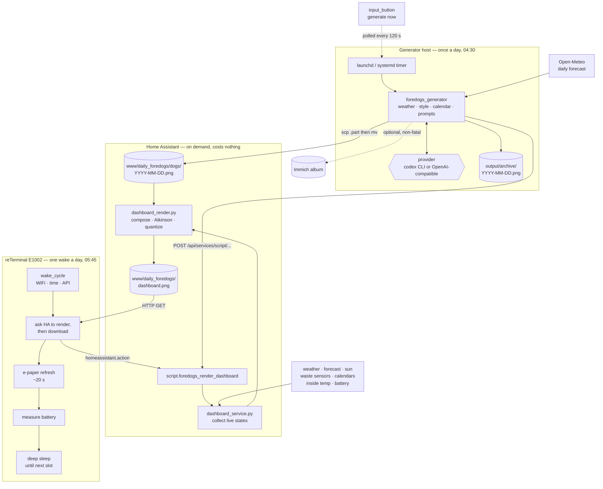
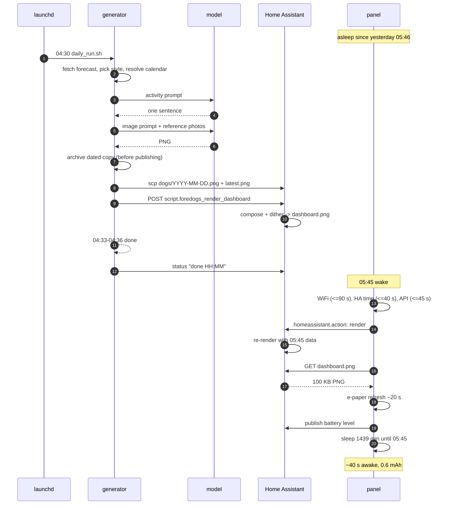

# Architecture

Three machines, each doing the one thing it is good at.

| | Runs | Does | Fails how? |
|---|---|---|---|
| **Generator host** | a Mac or a Linux box | Calls a model once a day, produces one picture | The panel keeps yesterday's picture |
| **Home Assistant** | wherever it already runs | Composites picture + live data into an 800x480 PNG | The panel keeps the last PNG on glass |
| **reTerminal E1002** | on the kitchen wall, on battery | Downloads that PNG and paints it | Nothing else notices |

The split is the whole design. Image generation costs money and takes minutes;
compositing costs nothing and takes three seconds; the microcontroller does
neither. No prompt, no model call and no forecast parsing ever reaches the
device — it downloads a finished PNG, paints it, and sleeps for 23.9 hours.

Each stage degrades into the previous one's last good output rather than into an
error. That is why the panel has never shown a blank screen, in a system where
every single component has failed at least once.

## The flow

Dotted edges are optional or indirect. The two that matter:

- **Immich is non-fatal.** A picture that fails to archive is still on the wall.
- **The button is polled, not pushed.** Home Assistant has no SSH key for the
  generator host, and giving it one would let a home automation server execute
  code on a workstation. The host polls instead — see
  [automation.md](automation.md#the-manual-trigger-and-why-it-polls).

## A day in the life

### The numbers behind it

| When | What | Typical duration |
|---|---|---|
| 04:30 | Generator starts | — |
| 04:30–04:36 | Model calls, both of them | 3–6 min |
| 04:36 | Upload, render request, Immich | ~15 s |
| every 30 min, 05:30–22:15 | Safety-net re-render | ~3 s, free |
| 05:45 | Panel wakes | — |
| 05:45 +40 s | Panel asleep again | ~40 s awake |
| 05:46 → 05:45 | Deep sleep | 23.9 h |

The hour between 04:30 and 05:45 is the generation budget. A normal run needs
three to six minutes; the spare time absorbs a slow model, a retry, or a quota
that only frees up later. If the run fails entirely, the panel still wakes and
still renders — with yesterday's picture and today's weather.

## The cycle in detail

1. **04:30, the scheduler starts the run.** `launchd` opens a login shell, which
   loads `FOREDOGS_HA_TOKEN` and `FOREDOGS_IMMICH_KEY` from
   `~/.config/foredogs/`, then runs `scripts/daily_run.sh`. `RunAtLoad` is
   deliberately `false`: loading the agent must not produce an image.
2. **Forecast and prompt assembly.** `weather.py` calls Open-Meteo for the
   configured location. The weather JSON, the selected style, the prompt history
   and today's celebrations all go into the activity prompt. The generator then
   builds the image prompt. With `include_weather_box: false` the prompt
   explicitly forbids the model from painting its own weather text — the
   renderer draws that, in fonts that survive dithering.
3. **Two model calls.** Text first, image second, through whichever provider is
   configured ([ai-providers.md](ai-providers.md)). Image generation retries up
   to three times.
4. **Local post-processing and the archive.** The original lands in
   `output/foredogs_original.png`; a copy is cropped to 800x480 and recoloured
   for Spectra 6. A dated copy goes to `output/archive/` **before** anything is
   published, so a failed upload does not also cost the local copy.
5. **Publish.** `publish.py` writes `/config/www/daily_foredogs/dogs/YYYY-MM-DD.png`
   by uploading `.<date>.png.part` first and moving it into place remotely, so
   Home Assistant never sees a half-copied file. `latest.png` is copied too.
6. **Render nudge, then Immich.** The generator POSTs to the render script, then
   archives to Immich. That order matters: the display has to work when Immich
   is unreachable, so archiving is last and non-fatal.
7. **Home Assistant composes.** `dashboard_service.py` reads weather, forecast,
   daylight, waste dates and the panel's own sensors into `DashboardData`;
   `dashboard_render.py` writes `dashboard.png` via a temporary file and an
   atomic replace.
8. **05:45, the panel wakes.** `wake_cycle` waits up to 90 s for WiFi, 40 s for a
   valid Home Assistant time and 45 s for the API — three separate waits,
   because RTC time can be valid while the Home Assistant connection is still
   missing.
9. **The device asks for a fresh render.** After `api.connected` plus three
   seconds for the action subscription, it sends `homeassistant.action`, waits
   eight seconds, and retries the download twice.
10. **E-paper refresh.** `do_refresh` holds the script lock for 25 seconds. The
    panel electronics need about 20; without the explicit wait, competing
    triggers produce `Display already in state POWER_OFF`.
11. **Battery, then the sleep slot.** Two seconds for the rail to settle, eight
    ADC samples 300 ms apart, then the percentage is published — and the script
    waits for the API to flush before cutting the radio. `sleep_evaluation`
    computes the distance to the next 05:45 and sets the duration explicitly.
12. **Deep sleep.** The e-paper holds the image with no power at all.

## Where the files are

| Path | What |
|---|---|
| `generator/output/foredogs_original.png` | This run's picture. Overwritten daily. |
| `generator/output/archive/YYYY-MM-DD.png` | Dated copies. The only durable local record. |
| `generator/state/` | Prompt history, style history, celebration history. |
| `/config/www/daily_foredogs/dogs/YYYY-MM-DD.png` | Published pictures, pruned after `keep_days`. |
| `/config/www/daily_foredogs/dashboard.png` | What the panel downloads. |
| `/config/www/daily_foredogs/dashboard_fingerprint.txt` | What was on it last time. |
| `/config/foredogs_data/fonts/` | Fonts for the renderer. Home Assistant OS ships none. |

## Three copies, and why that is the minimum

Each picture exists in three places, with three different lifetimes:

| Copy | Lives | Removed by |
|---|---|---|
| `output/archive/` on the generator host | indefinitely | `archive_keep_days` |
| `dogs/YYYY-MM-DD.png` on Home Assistant | `keep_days` | the render call |
| Immich album | indefinitely | you |

That looks redundant until all three fail at once, which has happened: the
working files were overwritten each run, Home Assistant was pruning after five
days, and the Immich server was down for weeks without anyone noticing. Sixteen
days of pictures are simply gone. The dated local archive exists because of that
week, and `keep_days` now defaults to 0 — keep everything, decide later.
