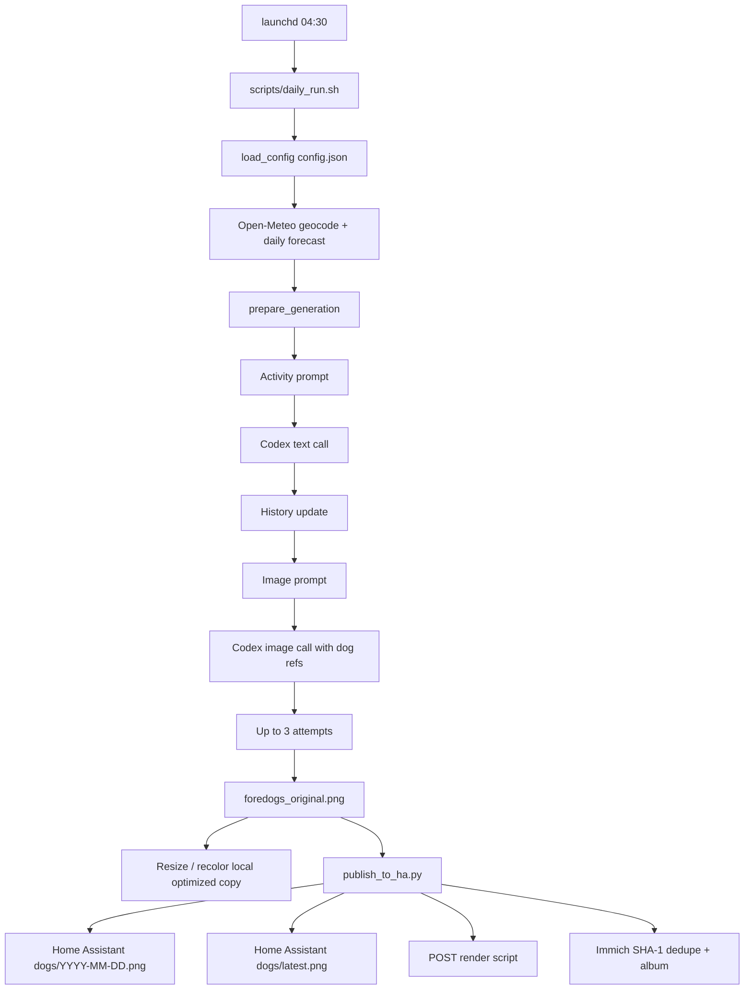

# The generator

## Purpose

`generator/` is the current generator. It runs independently of the Home
Assistant integration, fetches weather directly from Open-Meteo, builds two
prompts, produces a short activity description first and then exactly one
image. Home Assistant does not render the picture itself; it later composes the
delivered original together with live dashboard data.

The split is deliberate:

- Image generation costs money and runs once a day.
- Dashboard composition with weather, waste collection dates and battery costs
  nothing and can run independently.
- The E1002 downloads only a finished `dashboard.png`. No prompt, no model call
  and no complex forecast parsing ends up on the microcontroller.

The renderer says the same thing (`dashboard_render.py:29-39`): it never calls a
model. It takes the last generated picture and draws around it.

This page is about the pipeline and the prompts. Three neighbouring topics have
their own pages:

- every key in `config.json`, and where secrets live: [configuration.md](configuration.md)
- which model answers, and how to point it elsewhere: [ai-providers.md](ai-providers.md)
- the style pool and the calendar: [styles.md](styles.md)
- scheduling, publishing and the archive: [mac-pipeline.md](mac-pipeline.md)

## Pipeline



## Activity prompt: the actual text

`_build_activity_prompt()` lives in
`generator/foredogs_generator/generator.py:64-162`. The blocks below are the real
prompt, with dynamic Python expressions in `{...}`.

### Conditional blocks

**Celebration context**, only when an entry is active for the day. Produced by
`celebrations.activity_prompt_block()`:

```text
SPECIAL DAY:
Today is a celebration. Make it central to the activity, but keep the
real weather and season integrated — no generic party backdrop.
- Heiligabend
  Guidance: Christmas Eve, the big one in Germany: tree, presents, candlelight, family evening.
```

If the event occurred in earlier years, the block appends those activities with
an instruction to invent something different.

**Style without outfit**, when no `outfit` is set (`generator.py:86-95`):

```text
Art style: {style_name}
```

**Style with outfit** (`generator.py:86-93`):

```text
Art style: {style_name}
Outfit requirement: {outfit}
The activity must match that outfit naturally.
```

**Universe**, when the style has one (`generator.py:97-105`):

```text
IMPORTANT - Setting/Universe:
The scene MUST take place in: {universe}
Do NOT set the scene in {config.location} or other real-world locations.
The activity and background should be authentic to this universe.
```

**Style tone**, when the style entry carries a `tone` field:

```text
IMPORTANT - Tone for this style:
<the style's own tone text>
```

The field exists for looks whose surface aesthetic is easy to imitate badly —
the model reaching for "neon everywhere" instead of a place that happens to have
neon in it. It used to be a hard-coded branch for one particular style; as a
field it works for any of them, and none of the shipped examples set it. See
[styles.md](styles.md#the-style-pool).

### Full activity prompt

```text
You are a prompt generator for static AI cartoon art generation model. Your task is to generate an activity for {len(config.dog_names)} dogs to do based on the date and weather conditions provided, which will be used to draw a single picture.

The date is {forecast.get('datetime', '')}.

The weather forecast is for {config.location}.

The forecast is:
{json.dumps(forecast, ensure_ascii=False, indent=2)}
{style_context}
{holiday_context}

The last 20 activities you generated were:
{prompt_history[-PROMPT_HISTORY_LIMIT:]}

************************************************

Follow this prompt:

Generate a fun activity for {len(config.dog_names)} dogs to do together that fits the weather conditions, time of year, AND the art style/outfit above.

Heuristics:
- You can anthropomorphize the dogs to do human-like activities, or you can make them do more dog-like activities occasionally.
- The activity can be either indoors or outdoors.
- Activities should be 50% set in locations in {config.location}, 20% set in other specific locations with similar weather, and 30% set in generic locations.
- The mix of indoor/outdoor should be seasonally appropriate. Summer is mostly outdoor, winter is 50/50 indoor/outdoor.
- It can be a mundane activity or something more exciting.
- If a themed outfit is specified, the activity MUST match that theme.

Rules:
- You must come up with the following:
    - Activity: A short (<5 words) description of the activity
    - Foreground: A description of what the dogs are doing. Do NOT describe clothing.
    - Background: A description of the background elements.
- You don't have to describe the weather.
- Do not describe the general appearance of the dogs.
- Do not describe clothing or accessories in the Foreground.
- Mention a specific local real-world place name such as {config.location} at most once in the full output line.
- The activity should involve all {len(config.dog_names)} dogs.
- The activity must not be similar to any of the last 20 activities you generated.
- Respond in a single line, no more than 100 words.
- Do not use newlines.
- Respond with "Activity: <activity>, Foreground: <foreground>, Background: <background>"
```

The weather therefore reaches the prompt not as a short slug but as fully
formatted JSON, so the model can interpret temperature, precipitation, wind and
the summary together.

## Image prompt: the actual text

`_build_image_prompt()` lives in `generator.py:165-295`.

### Dynamic preconditions

1. `forecast.condition` is normalized: lowercased, spaces and hyphens removed
   (`generator.py:173-179`).
2. `WEATHER_MOODS` supplies a mood and a lighting hint per condition, for
   example `sunny` → `bright, cheerful, vibrant, happy` and `warm sunlight`.
3. With a `render_as` present, this is inserted:

```text
Specifically, render the dogs as {render_as}.
```

4. Without `render_as`, this is inserted instead:

```text
Render the dogs the way the game, show, or movie behind this style would natively depict a dog — using its own construction, line work, shading, palette, and resolution.
```

5. The style's own `tone`, if it has one, is appended as an extra rule.

### Style embodiment block

This block prevents the most common failure, a photorealistic dog standing in a
stylized set (`generator.py:188-205`):

```text
STYLE EMBODIMENT (very important):
Do NOT paste a photo-realistic dog into a stylized scene. The dogs must be fully REDRAWN as
characters created inside the world of "{art_style}", using that style's own character-design
language — its linework, shapes, PROPORTIONS, anatomy, face and eye design, shading, palette,
and resolution. A realistic or default-3D dog is wrong unless this style is itself photoreal.
- Carry the dogs' IDENTITY across only via: breed / silhouette cue, fur color and markings,
  and personality. Use the reference images for those cues only.
- Do NOT keep realistic proportions or realistic fur when the style is stylized. Let the
  style's drawing rules reshape the dog (flat 2D cartoon shapes, anime cel-shading, blocky
  voxels, paper cutout, comic ink, etc.).
{embodiment_line}
If this style is a 2D cartoon, anime, comic, or illustration, the dogs must be hand-DRAWN as
characters in that exact look — same proportions, line weight, and face/eye style as that
show/film/comic draws its own characters — never a realistic dog standing in a stylized set.
The dogs should still read as the same individual dogs, but as native characters of this style.
```

### `include_weather_box`: `false` in the live setup

With the switch set to `true`, `generator.py:221-235` would insert this block:

```text
Additionally, create a small box in the bottom left corner, in the style of the image. This box should contain TEXT IN GERMAN:
- A < three word description of the weather conditions
- The daily high temperature: "Höchst: {forecast.get('temperature')}°C"
- The daily low temperature: "Tiefst: {forecast.get('templow')}°C"
```

Plus these rules:

```text
- Do not place the temperature box too close to the edge, or overlapping any important details.
- Style the temperature box to fit the overall image and art style.
```

**With `include_weather_box: false`** the generator inserts no weather box but an
explicit prohibition (`generator.py:235-246`):

```text
- Do NOT draw any text, caption box, temperature readout, date, or weather label anywhere in the image. The scene must communicate the weather purely through visuals — the surrounding dashboard supplies the numbers. Incidental text that belongs to the world (a shop sign, a book cover) is fine.
```

That is not cosmetic. Without the prohibition the model regularly reads "daily
weather illustration" as an instruction to paint a weather box. The dashboard
draws the numbers later, sharp and palette-accurate; a second painted weather box
would be redundant and harder to read after dithering.

#### Exception on holidays and birthdays

The prohibition collides directly with the celebration block, which asks for
readable text on a sign, banner or cake. The model cannot resolve two
contradictory instructions in one prompt — in practice the blanket prohibition
wins and the birthday greeting silently disappears.

So when a celebration is active, the generator appends a carve-out to the same
rule instead of adding a second sentence next to it:

```text
... EXCEPTION: the celebration text named under CELEBRATION above is required, and is the only text allowed.
```

Seasons (`kind: season`) do **not** trigger this. Otherwise all 38 days of a
Christmas market season would carry a banner in the picture.

### Full image prompt

```text
You are an AI artist creating daily weather illustrations featuring dogs based on a weather forecast and an activity that will be given to you. Your task is to generate a vibrant and engaging illustration that captures the essence of the weather conditions and the dogs' activity in a specific art style.

The weather forecast is for {config.location} on {forecast.get('datetime', '')}:
{json.dumps(forecast, ensure_ascii=False, indent=2)}
{mood_context or 'Mood: weather-appropriate natural atmosphere.'}

You have {len(config.dog_names)} dogs to illustrate:
{", ".join(config.dog_names)}.

Here are their descriptions:
{chr(10).join("- " + description for description in config.dog_descriptions)}

The activity they are doing today is:
{activity}

The art style should be:
{art_style}

{style_embodiment}

You will be given reference photos.
Use these reference images to lock the dogs' identity, then re-render them fully in the art style above.

***********************************************

Create a vibrant and engaging illustration in the recommended style that captures the essence of the weather conditions and the dogs' activity. Use colors and elements that reflect the forecasted weather, making the scene lively and appropriate for the time of year.
{weather_box_block}
{celebration_block}
Heuristics:
- Try to capture the mood of the weather and activity in the illustration.
- Try to capture the dogs personalities, but it is okay if they change based on the weather and activity.
- This is for a color e-ink screen. Avoid very fine details that may be lost in dithering.

Rules:
- Only generate a single image.
- The final image will be cropped in postprocessing to {config.final_image_size}, so compose the image accordingly and DON'T place anything near the edges.
- Use a cinematic wide composition in {config.image_gen_aspect_ratio}.
- Target generation resolution: {config.image_gen_resolution}.
- The weather is important, so include elements that clearly indicate the weather conditions.
{weather_box_rule}
{weather_box_style_rule}
- Use the input images as references for the dogs' identity (breed, fur color, markings, ear/snout shape).
- Style the dogs to fit the activity and weather conditions.
- THE DOG(S) MUST STAY RECOGNIZABLE AS THE REFERENCE DOGS, but rendered fully in the art style's medium (see STYLE EMBODIMENT above) — not as photo-realistic dogs.
{style_specific_rules}
```

The forecast appears here as `json.dumps(..., ensure_ascii=False, indent=2)` as
well. The same weather information therefore drives activity, colour feel,
lighting and visible environmental elements.

## The flow in code

### 1. Prepare the plan

`prepare_generation()` (`generator.py:303-394`):

1. Seed the random number generator.
2. Resolve and create `state/` and `output/`.
3. Seed prompt and style history from the configured seed paths, if no local
   history exists yet.
4. Clean up the histories.
5. Load the forecast, or use `forecast_override`.
6. Determine the celebration and, if any, its outfit.
7. Choose a style.
8. Write status `running`.
9. Save the activity prompt and generate the activity.
10. Trim the activity history to the last 20 entries.
11. Trim the style history to the last 20 entries.
12. Save the image prompt.
13. Check the reference images.
14. Return a `GenerationPlan`.

### 2. Status file

`output/foredogs_generation_status.json` carries, among other things:

- `status`: `running`, `dry_run`, `ok` or `failed`,
- a UTC timestamp,
- `forecast`,
- the chosen `style`,
- `activity`,
- the original and optimized paths on success,
- error messages after three failed image attempts.

### 3. Generate and post-process the image

`render_generation_plan()` (`generator.py:397-481`):

- `dry_run` produces prompts and status only.
- A live run tries `generate_image_file()` up to three times.
- Pillow then opens the original.
- `resize_image()` uses `ImageOps.fit()` with `LANCZOS`, target `800x480`,
  left-aligned and vertically centred
  (`generator/foredogs_generator/image_processing.py:12-24`).
- `recolor_image()` maps real display colours onto neutral source colours for
  `spectra6` and applies Pillow's Floyd-Steinberg dithering in the local copy
  (`image_processing.py:27-51`).
- The original and the optimized copy are saved separately.

The Home Assistant renderer dithers the original again for its own panel, which
is why `publish_to_ha.py` deliberately loads `foredogs_original.png` rather than
`foredogs_optimized.png`.

## Legacy generator in the Home Assistant integration

`custom_components/foredogs/foredogs.py` predates the current macOS path. It
takes a `GenerateRequest` from `models.py`, calls an OpenAI-compatible endpoint,
and internally uses `gemini-2.5-flash` for the activity and `gemini-3-pro-image`
with `extra_body={"size": "1280x720"}` for images (`foredogs.py:43-48`,
`foredogs.py:649-652`, `foredogs.py:812-816`). The endpoint defaults to Google's
public one and can be redirected with `FOREDOGS_OPENAI_BASE_URL`.

This path:

- handles optional companion people,
- reads `foredogs_data/celebrations.yaml`,
- writes `/config/www/daily_foredogs/foredogs_original.png` and
  `foredogs_optimized.png` (`foredogs.py:289-472`),
- still contains the old built-in weather box (`foredogs.py:778-793`).

The standalone generator is separate from it. `services.yaml` and
`manifest.json` still carry parts of the old contract. This is not an equally
active second pipeline but a compatibility layer — useful if you have no
separate host to run the generator on, and otherwise best left alone.
