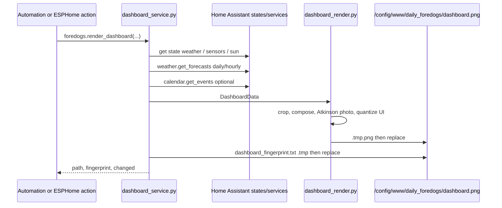

# Home Assistant integration

## What the Home Assistant side does

Home Assistant is the free composition and state service. It takes an
already-generated picture and combines it with data the Mac has no reliable way
to know:

- current and daily weather,
- the hourly precipitation and temperature curve,
- sunrise, sunset and day length,
- indoor temperature and humidity,
- the battery percentage of the sleeping display,
- waste collection dates from sensors or calendars,
- optionally photos for page 3.

The current render path runs through `foredogs.render_dashboard` and never calls
an image model. `foredogs.generate_dog_picture` still exists as a legacy
service, but it is not part of the current daily cycle.

This page covers installing the integration, the two service contracts and what
happens when a render is requested. What the rendered panel *contains* — every
region, the palette, the fonts, the dithering and which entity feeds which cell
— is [dashboard.md](dashboard.md). The helper entities, scripts and automations
around it are [automation.md](automation.md).

## Integration and service contracts

### Setup

The minimal `configuration.yaml` addition
(`examples/homeassistant/configuration.snippet.yaml`):

```yaml
# Loads default set of integrations. Do not remove.
default_config:

foredogs:

automation: !include automations.yaml
scene: !include scenes.yaml
script: !include scripts.yaml
```

`manifest.json` identifies the integration as:

| Key | Value |
|---|---|
| `domain` | `foredogs` |
| `name` | `Daily Foredogs` |
| `config_flow` | `false` |
| `iot_class` | `local_polling` |
| `version` | `2.0.0` |
| `requirements` | `openai>=1.40.0`, `Pillow>=12.0.0` |

`openai` is there for the legacy picture path in `foredogs.py`, which is
imported when the integration loads; the dashboard renderer needs only Pillow.

### `foredogs.generate_dog_picture`

Schema in `__init__.py:83-103`, handler in `__init__.py:107-128`. Required
fields:

- `gemini_api_key`,
- `location`,
- `forecast`,
- `dog_names`,
- `dog_descriptions`,
- `input_image_paths`,
- `image_gen_aspect_ratio`,
- `image_gen_resolution`,
- `final_image_size`.

Optional fields:

- `art_styles`,
- `person_names`, `person_descriptions`, `person_image_paths`,
- `person_inclusion_probability` (default `0.4`),
- `display_profile`.

The handler runs `generate_dog_pic()` in an executor. This older path writes
`foredogs_original.png` and `foredogs_optimized.png` directly into
`/config/www/daily_foredogs/` (`foredogs.py:289-472`).

### `foredogs.render_dashboard`

Schema in `__init__.py:57-80`, service handler in `__init__.py:130-168`. The
main parameters:

| Parameter | Type / default | Purpose |
|---|---|---|
| `weather_entity` | required, entity ID | Weather state plus forecast source. |
| `inside_temp_entity` | optional | E1002 SHT40 temperature. |
| `inside_humidity_entity` | optional | E1002 SHT40 humidity. |
| `battery_entity` | optional | E1002 battery percentage. |
| `waste_sensors` | list | Sensors with `entity_id`, `label`, `kind`. |
| `waste_calendars` | list | Calendar sources with `entity_id`, `label`, `kind`, `match`. |
| `source_image` | default `foredogs_original.png` | Single file, relative to `/config/www/daily_foredogs` or absolute. |
| `image_dir` | optional | Preferred folder for dated and weather-specific pictures. |
| `keep_days` | default `0` | Delete dated pictures older than this; `0` means never delete. |
| `dither_photo` | default `true` | Atkinson dithering for the photo/picture region. |
| `page` | `1`, range `1..3` | Page: 1 home, 2 weather detail, 3 photo. |
| `page_count` | `1`, range `1..3` | Drives the `Seite n/m` marker. |
| `photo` | `{}` | Immich or folder source for page 3. |

Return value:

```json
{
  "changed": true,
  "fingerprint": "...",
  "error": false
}
```

`changed` is a comparison value for automations and the logbook. The current
firmware no longer uses that saving and always refreshes after a successful
download (`esphome/e1002-kitchen.yaml:509-520`).

## Render flow

`render_kitchen_dashboard()` lives in `dashboard_service.py:532-660`.



In detail:

1. `static_dir` is created as `/config/www/daily_foredogs`
   (`dashboard_service.py:558-560`).
2. `source_image` is resolved relative to that directory.
3. With `image_dir` set, Home Assistant calls `pick_image()` in an executor;
   `prune_old()` optionally runs afterwards.
4. `collect_dashboard_data()` reads everything needed.
5. `fingerprint(data)` describes the displayed state.
6. The PNG is **always** rendered, even for an unchanged fingerprint. That keeps
   the file present and current when a device requests it for the first time
   (`dashboard_service.py:626-641`).
7. The renderer writes `/dashboard.tmp.png` and replaces atomically. The
   fingerprint is written the same way and swapped in with `Path.replace()`
   (`dashboard_service.py:642-647`).

## Legacy colour processing

The old Home Assistant generator uses
`custom_components/foredogs/image_processing.py`, not the identically named file
in `generator/`. `recolor_image()` (`image_processing.py:34-70`) builds two
palettes for `spectra6`:

- `true_palette`: more realistic source colours for the quantization,
- `device_palette`: the six target colours for the device.

The current map (`image_processing.py:83-94`) holds black, white, blue, green,
red and yellow. Pillow quantizes with `Image.Dither.FLOYDSTEINBERG`, and the
palette is then swapped for the device colours. The current dashboard renderer
does something different: Atkinson for photos, hard nearest-colour quantization
for UI chrome. Do not mix the two colour paths.

## Private celebrations and legacy people

`custom_components/foredogs/celebrations.py` extends the old generator
(`foredogs.py`) with:

- birthdays, anniversaries and `nth_weekday` rules,
- priorities when several events collide,
- `{ordinal}`, `{years}`, `{name}`, `{year}`,
- event history in `celebrations_history.json`,
- targeted companion people (`all`, `none`, a list, or a name).

The example configuration is `examples/homeassistant/celebrations.yaml`; at
runtime it would be `/config/foredogs_data/celebrations.yaml`. `foredogs.py`
loads it (`foredogs.py:330-365`) and writes the history
(`foredogs.py:417-426`). The macOS generator does not read this file; it has its
own calendar in `generator/foredogs_generator/celebrations.py`.

## The examples in this repository

| File | Assessment |
|---|---|
| `examples/homeassistant/configuration.snippet.yaml` | Current minimal integration setup. |
| `examples/homeassistant/kitchen_dashboard_helpers.yaml` | Current helper approach for `input_boolean.e1002_stay_awake`. |
| `examples/homeassistant/kitchen_dashboard_automations.yaml` | The render automation, the low-battery warning, and an optional in-Home-Assistant generation automation. |
| `examples/homeassistant/render_dashboard_script.yaml` | The render script both the panel and the generator call. Every field is commented. |
| `examples/homeassistant/celebrations.yaml` | Optional calendar format for the legacy in-Home-Assistant generator only. The standalone generator has its own, in `examples/generator/`. |

## A Home Assistant mistake that produces no registry entry

Hand-written `.storage` `config_entries` do not produce an entity registry
entry. Home Assistant creates the registry record through the integration's
setup or options flow. New entities therefore have to come from real integration
setup — UI or YAML — not from writing `.storage` by hand.
